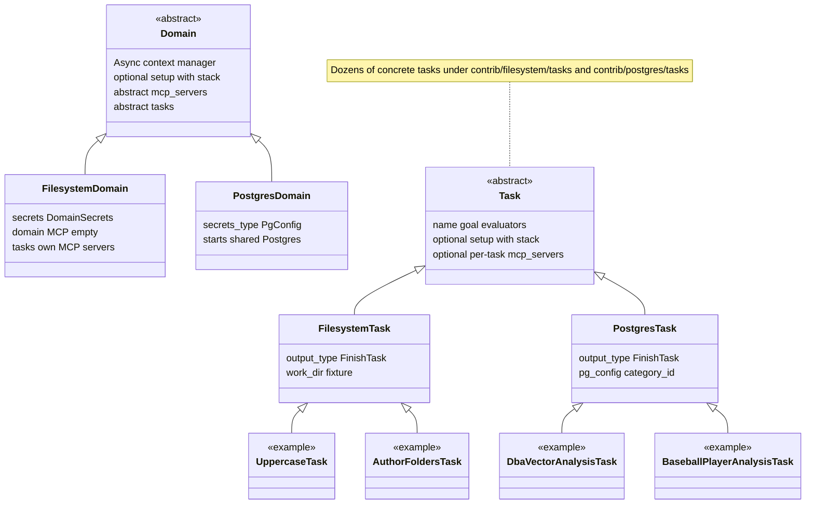

## Summary: Domain and Task Pattern

This matches `src/mcp_evals` today. For runner options (`deps_maker`, `run_result_processor`, groupers, callbacks), see [`README.md`](./README.md).

### 1. **Core abstractions**

- **`Domain`** (`src/mcp_evals/domain.py`): Async context manager that:
  - Has a `name`
  - Optionally `supports_concurrency: ClassVar[bool]` if tasks in this domain may run concurrently
  - Implements `mcp_servers()` → sequence of MCP server configs (often passed `tool_retries` into server/toolset constructors)
  - Implements `tasks()` → sequence of `Task` instances
  - Optionally overrides **`async def setup(self, stack: AsyncExitStack[Any]) -> None`** for shared env (temp dirs, shared containers). **All cleanup must be registered on `stack`** (`stack.callback`, `stack.enter_async_context`, etc.); there is no separate user-facing `teardown()` hook on `Domain`
  - After enter: MCP servers are connected and **`toolset`** is available until the domain context exits

- **`Task`** (`src/mcp_evals/task.py`): One evaluation case with:
  - `name`, **`goal`** (string prompt — class attribute, `@property`, or via mixin; see below), **`evaluators: tuple[Evaluator[Self, AgentRunResult], ...]`**
  - Optional `output_type`, `secrets_type` (`ClassVar`)
  - Optional **`async def setup(self, stack: AsyncExitStack[Any]) -> None`** for per-task env; same rule — bind cleanup to **`stack`**, no user `teardown()` API
  - Optional **`mcp_servers()`** returning extra MCP servers for this task only (e.g. filesystem tasks each start a Docker-backed filesystem MCP bound to `work_dir`)

Install optional domain deps when you use contrib domains, e.g. `uv sync --extra domain-filesystem` or `--extra domain-postgres` (see [`pyproject.toml`](./pyproject.toml)).



---

### 2. **Adding a new domain (contrib layout)**

Reference trees: **`mcp_evals.contrib.filesystem`** and **`mcp_evals.contrib.postgres`**.

1. **Create a package** under `src/mcp_evals/contrib/<domain_name>/`.

2. **Domain class** (often `domain.py`)
   - Subclass `Domain[YourSecrets]` (default secrets type is `DomainSecrets` from `mcp_evals.secrets`).
   - Set `name`.
   - Implement `mcp_servers()` and `tasks()`.
   - Override **`setup(stack)`** if the domain needs shared resources; register teardown on **`stack`** only.

3. **Domain-level utilities (optional)**  
   e.g. `utils.py` for config, fixtures, downloads — shared by the domain and tasks.

4. **Public API**  
   In `contrib/<domain_name>/__init__.py`, export the domain and any public helpers (e.g. `Fixture`, `PgConfig`).

---

### 3. **Adding tasks for that domain**

TODO outline directory tree

1. **Domain-specific base task (recommended)**  
   e.g. `FilesystemTask` / `PostgresTask` in `contrib/<domain>/task.py`:
   - Shared constructor args (paths, DB config, fixture ids, …).
   - Shared **`setup(stack)`**: download fixtures, create DBs, register `stack.callback` / async context managers so resources outlive the agent run through evaluators.

2. **One subfolder per task** under `tasks/<task_slug>/` (convention; postgres sometimes uses a single `custom_evaluator.py` instead of a `custom_evaluators/` package):
   - **`task.py`**  
     - Concrete class subclassing the domain base task.
     - `name` (and **`goal`** — see below).
     - `__init__` calls `super().__init__(..., tool_retries=...)` if needed and sets **`self.evaluators = (...)`** (tuple).
   - **`description.md`** (common pattern)  
     When the base task uses **`GoalFromDescriptionMixin`**, `goal` is loaded from `description.md` next to the task module — you do **not** duplicate the full prompt as a class attribute.
   - **`constants.py`** (optional) — shared literals for task + evaluators.
   - **`custom_evaluators/`** (optional) — one module per evaluator; `__init__.py` re-exports. Evaluators are typically `Evaluator[YourTask, AgentRunResult]` with `async def evaluate(ctx) -> EvaluatorOutput`.
   - **`custom_evaluator.py`** (optional, postgres-style) — single module when the task only needs one or two local evaluators.
   - **`utils.py`** (optional) — helpers for this task only.

3. **`goal` options**
   - Class attribute or `@property def goal(self) -> str` on the concrete task.
   - Or inherit **`GoalFromDescriptionMixin`** (with `description.md` in the task package) like most filesystem/postgres tasks.

4. **Shared evaluators**  
   `common_evaluators/` at domain level for reuse (`FileExists`, query matchers, etc.).

5. **Registration**
   - `tasks/__init__.py`: import task classes, export in `__all__`.
   - Domain’s `tasks()`: instantiate with the right args (`work_dir`, `Fixture.*`, `PgConfig`, …) and return a sequence.

**`tool_retries`:** Both `Domain` and `Task` accept `tool_retries` in `__init__`; pass through to MCP configs where supported.

---

### 4. **Flow at runtime**

- **`DomainRunner`** is built with an `agent`, a **grouper**, and optional hooks (see `README.md`).
- **`await runner.run(domain, experiment_name=...)`**  
  - **`async with domain`**: domain **`setup(stack)`** runs, then MCP servers connect and **`domain.toolset`** is ready.  
  - Tasks are converted to a pydantic_evals **`Dataset`** (each task → **`Case`** with `inputs=task`, `evaluators=task.evaluators`).  
  - Per case, **`CaseLifecycle`** keeps the **task** context open for both **agent run** and **evaluator** runs (so fixtures and MCP state still exist while evaluators check the environment), then exits the task context (stack closes).  
  - Leaving the domain disconnects MCP toolsets; domain **`stack`** closes.

**Summary:** domain = shared MCP (and optional shared setup) + task list; task = goal + evaluators + optional **`setup(stack)`** + optional per-task **`mcp_servers()`**; evaluators read **`ctx.inputs`** (the task instance) and/or external state.

---

### 5. **Checklist for a new domain + tasks**

| Step | Where | What |
|------|--------|------|
| 1 | `contrib/<domain>/domain.py` | Subclass `Domain`, set `name`, `mcp_servers()`, `tasks()`, optional `setup(stack)`. |
| 2 | `contrib/<domain>/task.py` | (Optional) Base task + shared `setup(stack)`. |
| 3 | `contrib/<domain>/utils.py` | (Optional) Shared helpers / config types. |
| 4 | `contrib/<domain>/common_evaluators/` | (Optional) Reusable evaluators. |
| 5 | `contrib/<domain>/tasks/<task_slug>/task.py` | Concrete task: `name`, `goal` or mixin + `description.md`, `evaluators` in `__init__`. |
| 6 | `contrib/<domain>/tasks/<task_slug>/` | Task-specific evaluators: `custom_evaluators/` **or** `custom_evaluator.py`; export as needed. |
| 7 | `contrib/<domain>/tasks/__init__.py` | Export task classes. |
| 8 | `contrib/<domain>/__init__.py` | Export public domain API. |
| 9 | Runner | `DomainRunner(agent=..., grouper=PlainGrouper(), ...)` then `await runner.run(domain, experiment_name=...)`. |

---

### 6. **How to validate**

```bash
uv run mypy .
uv run ruff format
uv run ruff check --fix
```
