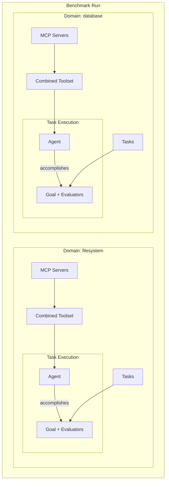
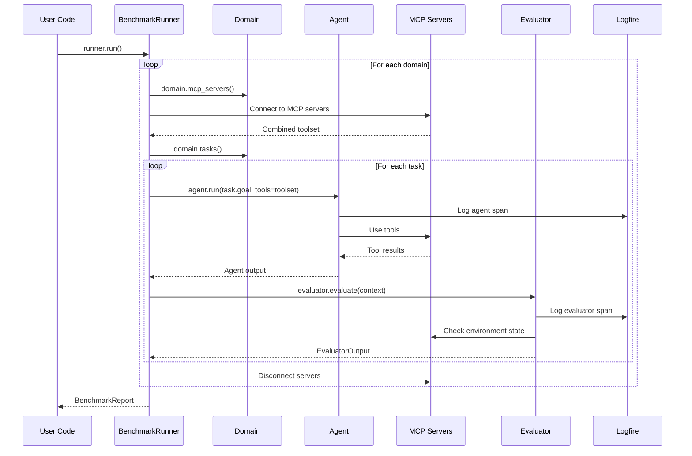

# MCP Evals

A code-first evaluation framework for testing LLM agents' ability to use MCP (Model Context Protocol) tools and accomplish tasks.

## Overview

This library provides infrastructure for running structured evaluations of LLM agents against MCP-enabled environments. Each task is defined by:

- **Domain**: A collection of MCP servers providing tools
- **Goal**: A text-described objective for the agent
- **Evaluators**: Functions that verify task completion and compute metrics

## Key Principles

| Principle | Implementation |
|-----------|----------------|
| **Code-first** | All tasks defined in Python, no YAML/JSON configs |
| **Simple user API** | Users define domains and tasks; library handles orchestration |
| **No wheel reinvention** | pydantic-ai for LLM + MCP, pydantic_evals for evaluation, logfire for observability |
| **Resource lifecycle** | Async context managers with safe cleanup |
| **Dependency injection** | Dishka for resource acquisition and cleanup |
| **Maintainability** | pytest, mypy, ruff |

## Prerequisites

### uv (for running MCP servers)

Many MCP servers are distributed as Python packages and run via `uvx` (part of [uv](https://github.com/astral-sh/uv)). `uvx` runs CLI tools in isolated environments without global installation — similar to `npx` for Node.js.

```bash
# Install uv
curl -LsSf https://astral.sh/uv/install.sh | sh

# Now you can run MCP servers like:
uvx mcp-server-filesystem /workspace
uvx mcp-server-sqlite test.db
```

MCP servers are available from:
- [Official MCP servers](https://github.com/modelcontextprotocol/servers)
- PyPI (search for `mcp-server-*`)

## Quick Start

```python
from mcp_evals import BenchmarkRunner, Domain, Task
from mcp_evals.evaluators import FileExists
from pydantic_ai import Agent
from pydantic_ai.mcp import MCPServerStdio

class FilesystemDomain(Domain):
    name = "filesystem"
    
    def mcp_servers(self):
        return [MCPServerStdio("uvx", "mcp-server-filesystem", "/workspace")]
    
    def tasks(self):
        return [
            Task(
                name="create_config",
                goal="Create a config.json file with default settings",
                evaluators=[FileExists("config.json")],
            ),
            Task(
                name="create_readme",
                goal="Create a README.md with project description",
                evaluators=[FileExists("README.md")],
            ),
        ]

async def main():
    agent = Agent("openai:gpt-4o")
    runner = BenchmarkRunner(agent=agent, domains=[FilesystemDomain()])
    report = await runner.run()
    report.print()
```

## Usage

### 1. Define a Domain with Tasks

A domain encapsulates an environment (MCP servers) and the tasks that test it:

```python
from mcp_evals import Domain, Task
from mcp_evals.evaluators import SQLQueryReturns
from pydantic_ai.mcp import MCPServerStdio

class DatabaseDomain(Domain):
    name = "database"
    
    def mcp_servers(self):
        return [MCPServerStdio("uvx", "mcp-server-sqlite", "test.db")]
    
    def tasks(self):
        return [
            Task(
                name="create_users_table",
                goal="Create a users table with id, name, and email columns",
                evaluators=[
                    SQLQueryReturns(
                        query="SELECT name FROM sqlite_master WHERE type='table'",
                        expected=["users"],
                    ),
                ],
            ),
            Task(
                name="insert_user",
                goal="Insert a user named 'Alice' with email 'alice@example.com'",
                evaluators=[
                    SQLQueryReturns(
                        query="SELECT name, email FROM users",
                        expected=[("Alice", "alice@example.com")],
                    ),
                ],
            ),
        ]
```

### 2. Run the Benchmark

```python
from mcp_evals import BenchmarkRunner
from pydantic_ai import Agent
import logfire

logfire.configure()

async def main():
    agent = Agent(
        "openai:gpt-4o",
        system_prompt="You are a helpful assistant.",
    )
    
    runner = BenchmarkRunner(
        agent=agent,
        domains=[FilesystemDomain(), DatabaseDomain()],
    )
    
    report = await runner.run()
    report.print()
    
    # Access detailed results
    for result in report.results:
        print(f"{result.task_name}: {'✓' if result.passed else '✗'}")
        for metric in result.metrics:
            print(f"  {metric.name}: {metric.value}")
```

### 3. Custom Evaluators

Create domain-specific evaluators using `pydantic_evals` base classes:

```python
from pydantic_evals.evaluators import Evaluator, EvaluatorContext
from pydantic_evals import EvaluatorOutput

class APIResponseContains(Evaluator[TaskInput, TaskOutput]):
    endpoint: str
    expected_field: str
    
    async def evaluate(
        self, ctx: EvaluatorContext[TaskInput, TaskOutput]
    ) -> EvaluatorOutput:
        # Access the task output
        response = ctx.output
        
        if self.expected_field in response:
            return EvaluatorOutput(score=1.0)
        else:
            return EvaluatorOutput(
                score=0.0,
                reason=f"Field '{self.expected_field}' not found in response",
            )
```

See [pydantic_evals documentation](https://ai.pydantic.dev/evals/) for more details on evaluator types and context.

## Architecture

### High-Level Flow



### Evaluation Pipeline



Internally, each domain is converted to a `pydantic_evals.Dataset` which orchestrates running the agent on different tasks, executing evaluators on agent results and sending evaluation results to Logfire.

### Scope Lifecycle

The library internally manages three scopes for proper resource lifecycle:

| Scope | Lifecycle | Resources |
|-------|-----------|-----------|
| `BENCHMARK` | Entire evaluation run | Global config, logfire client |
| `DOMAIN` | Per domain | MCP connections, combined toolset |
| `TASK` | Per task execution | Task-specific context |

Users don't need to manage these scopes directly—`BenchmarkRunner` handles everything.

## Project Structure

```
mcp-evals/
├── src/mcp_evals/
│   ├── __init__.py           # Public API: Domain, Task, BenchmarkRunner, etc.
│   ├── domain.py             # Domain ABC
│   ├── task.py               # Task dataclass
│   ├── runner.py             # BenchmarkRunner facade
│   ├── evaluators/
│   │   ├── __init__.py       # Public evaluators
│   │   └── builtin.py        # FileExists, ContentMatches, etc.
│   ├── _internal/
│   │   ├── scopes.py         # Dishka scope definitions
│   │   ├── providers.py      # DI providers
│   │   └── container.py      # Container factory
│   └── contrib/              # Pre-built domains (optional)
│       ├── filesystem.py
│       └── sqlite.py
├── examples/
│   ├── filesystem_eval/
│   └── database_eval/
└── tests/
```

## API Reference

### `Domain` (ABC)

```python
class Domain(ABC):
    @property
    @abstractmethod
    def name(self) -> str:
        """Unique domain identifier."""

    @abstractmethod
    def mcp_servers(self) -> list[MCPServerStdio | MCPServerHTTP]:
        """Return MCP server configurations."""

    @abstractmethod
    def tasks(self) -> list[Task]:
        """Return tasks to evaluate in this domain."""
```

### `Task`

```python
@dataclass
class Task:
    name: str                        # Unique task identifier
    goal: str                        # Prompt for the agent
    evaluators: list[Evaluator]      # Verification functions
    output_type: type | None = None  # Optional structured output
```

### `BenchmarkRunner`

```python
class BenchmarkRunner:
    def __init__(
        self,
        agent: Agent,
        domains: list[Domain],
    ) -> None: ...

    async def run(self) -> BenchmarkReport:
        """Run all tasks from all domains."""
        ...
```

### Evaluators

This library uses [pydantic_evals](https://ai.pydantic.dev/evals/) for evaluation infrastructure. Key types:

- `Evaluator[InputT, OutputT]` — Base class for custom evaluators
- `EvaluatorContext[InputT, OutputT]` — Context passed to evaluators with input/output data
- `EvaluatorOutput` — Result containing score, reason, and optional labels

See `mcp_evals.evaluators` for built-in evaluators.

## Built-in Evaluators

TODO

## Pre-built Domains

TODO

## Dependencies

- **[pydantic-ai](https://ai.pydantic.dev/)** — LLM provider abstraction + MCP client
- **[pydantic-evals](https://ai.pydantic.dev/evals/)** — Evaluation infrastructure
- **[logfire](https://pydantic.dev/logfire)** — Observability and tracing
- **[dishka](https://github.com/reagento/dishka)** — Dependency injection and resources lifecycle (internal)

## Development

```bash
# Install dependencies
uv sync

# Run tests
uv run pytest

# Type checking
uv run mypy src/

# Linting
ruff check --fix
ruff format
```
