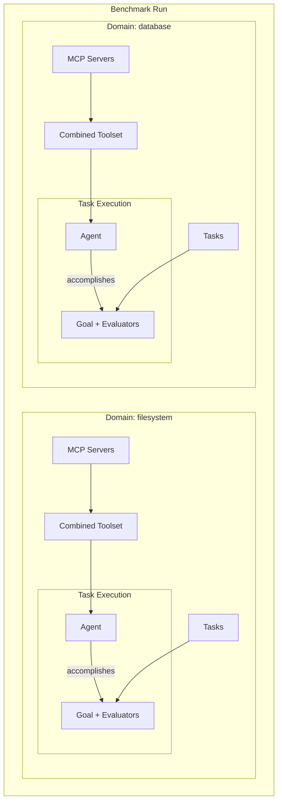
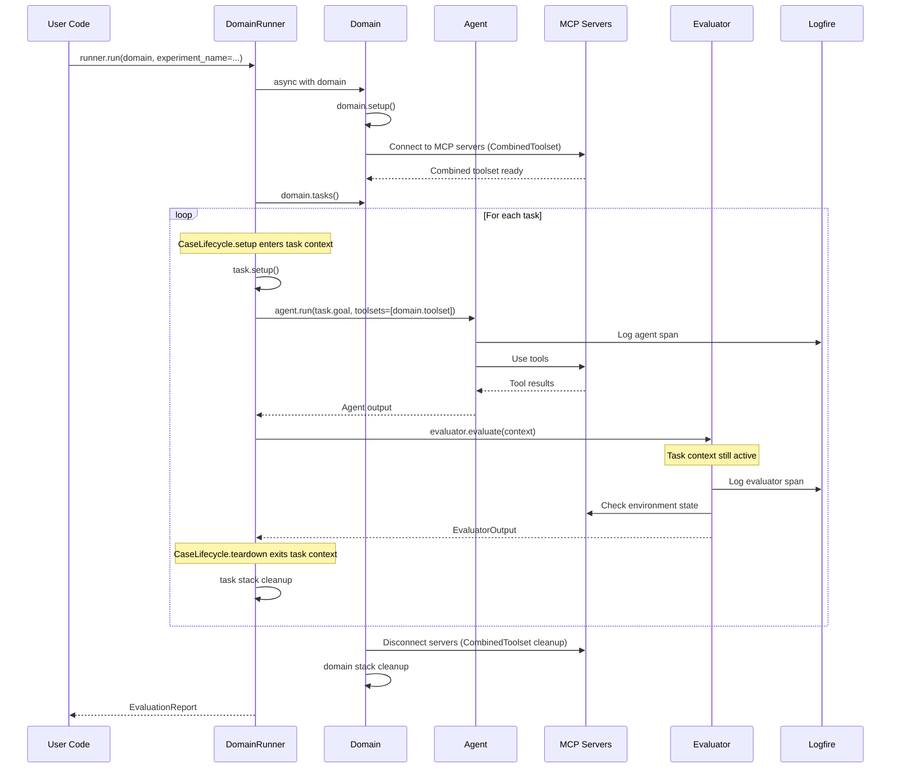
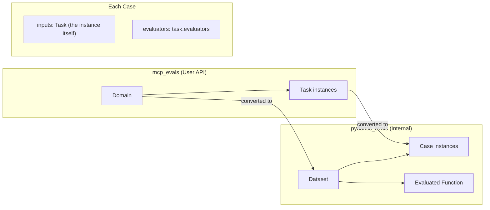

# MCP Evals

A code-first evaluation framework for testing LLM agents' ability to use MCP (Model Context Protocol) tools and accomplish tasks.

## Overview

This library provides infrastructure for running structured evaluations of LLM agents against MCP-enabled environments. Each task is defined by:

- **Domain**: A collection of MCP servers providing tools
- **Goal**: A text-described objective for the agent
- **Evaluators**: Functions that verify task completion and compute metrics

## Key Principles

| Principle | Implementation |
|-----------|----------------|
| **Code-first** | All tasks defined in Python, no YAML/JSON configs |
| **Simple user API** | Users define domains and tasks; library handles orchestration |
| **No wheel reinvention** | pydantic-ai for LLM + MCP, pydantic_evals for evaluation, loguru for logging, logfire for observability |
| **Resource lifecycle** | Async context managers with safe cleanup |
| **Maintainability** | pytest, mypy, ruff | 

## Prerequisites

For running MCP servers you might need
- [`uv`](https://docs.astral.sh/uv/)
- `docker`
- [`npm`](https://docs.npmjs.com/downloading-and-installing-node-js-and-npm)

## Quick Start

```python
from mcp_evals import DomainRunner, PlainGrouper
from mcp_evals.contrib.filesystem import FilesystemDomain
from pydantic_ai import Agent

async def main():
    agent = Agent("openai:gpt-4o")
    runner = DomainRunner(agent=agent, grouper=PlainGrouper())
    report = await runner.run(FilesystemDomain(), experiment_name="quickstart")
    report.print()
```

Requires `uv sync --extra domain-filesystem` and Docker. To run the full benchmark:

```bash
uv run python scripts/run_domain_tasks.py
```

## Basic Usage

Here's the plan on how to create and run your own tasks.

### 1. Define Tasks

Tasks define what the agent should accomplish, how to verify it and optionally how to allocate resources for that:

```python
from mcp_evals import Task
from mcp_evals.contrib.filesystem.common_evaluators import FileExists, ContentMatches

class CreateConfigTask(Task):
    name = "create_config"
    goal = "Create a config.json file with default settings"
    evaluators = [FileExists("config.json")]

class CreateReadmeTask(Task):
    name = "create_readme"
    goal = "Create a README.md with project description"
    evaluators = [
        FileExists("README.md"),
        ContentMatches("README.md", pattern=r"project description"),
    ]
```

This example uses evaluators implemented for Filesystem domain tasks, adapted from mcpmark.

### 2. Define a Domain

A domain encapsulates an environment (resources like MCP servers, temporary directories, docker containers) and groups related tasks. Pre-built domains adapted from mcpmark: `FilesystemDomain` and `PostgresDomain` in `mcp_evals.contrib.filesystem` and `mcp_evals.contrib.postgres`:

```python
from mcp_evals import Domain
from pydantic_ai.mcp import MCPServerStdio

class CustomDomain(Domain):
    name = "custom"
    
    def mcp_servers(self):
        return [MCPServerStdio("uvx", "mcp-server-filesystem", "/workspace")]
    
    def tasks(self):
        return [CreateConfigTask(), CreateReadmeTask()]
```

### 3. Run the Benchmark

```python
from mcp_evals import DomainRunner, PlainGrouper
from mcp_evals.contrib.filesystem import FilesystemDomain
from pydantic_ai import Agent

async def main():
    agent = Agent("openai:gpt-4o", system_prompt="You are a helpful assistant.")
    runner = DomainRunner(agent=agent, grouper=PlainGrouper())
    report = await runner.run(FilesystemDomain(), experiment_name="my-experiment")
    report.print()
    for case in report.cases:
        passed = all(s.value == 1.0 for s in case.scores.values())
        print(f"{case.name}: {'✓' if passed else '✗'}")
```

For observability, use `logfire.configure()` and `logfire.instrument_pydantic_ai()` (optional).

## Advanced Usage

### 1. Custom Evaluators

Create domain-specific evaluators using `pydantic_evals` base classes:

```python
from pydantic_evals.evaluators import Evaluator, EvaluatorContext, EvaluatorOutput, EvaluationReason

class APIResponseContains(Evaluator[TaskInput, TaskOutput]):
    endpoint: str
    expected_field: str
    
    async def evaluate(
        self, ctx: EvaluatorContext[TaskInput, TaskOutput]
    ) -> EvaluatorOutput:
        # Access the task output
        response = ctx.output
        
        if self.expected_field in response:
            return 1.0
        else:
            return EvaluationReason(
                value=0.0,
                reason=f"Field '{self.expected_field}' not found in response",
            )
```

See [pydantic_evals documentation](https://ai.pydantic.dev/evals/) for more details on evaluator types and context.

### 2. Tasks with Lifecycle (Setup)

Tasks implement `setup(stack)` and register cleanup via the `AsyncExitStack`. No `teardown()` — the stack handles cleanup when the task context exits:

```python
from contextlib import AsyncExitStack
from pathlib import Path
from typing import Any

import aiofiles.tempfile
import os

from mcp_evals import Task
from mcp_evals.contrib.filesystem.common_evaluators import ContentMatches, FileExists

class MusicReportTask(Task):
    name = "music_report"
    goal = "Analyze the music files and create music_analysis_report.txt"
    evaluators = [
        FileExists("music/music_analysis_report.txt"),
        ContentMatches("music/music_analysis_report.txt", pattern=r"晴天.*2\.576"),
    ]

    async def setup(self, stack: AsyncExitStack[Any]) -> None:
        # Create temp directory — stack.enter_async_context ensures cleanup
        temp_dir_ctx = aiofiles.tempfile.TemporaryDirectory()
        self.test_dir = Path(await stack.enter_async_context(temp_dir_ctx))

        # Download and extract test fixtures
        archive_path = await download_fixtures("music_collection.tar.gz")
        stack.callback(lambda: archive_path.unlink(missing_ok=True))

        await extract_archive(archive_path, self.test_dir)

        # Set env var for MCP server; restore on exit
        old_value = os.environ.get("FILESYSTEM_ROOT")
        os.environ["FILESYSTEM_ROOT"] = str(self.test_dir)
        stack.callback(lambda: _restore_env("FILESYSTEM_ROOT", old_value))

def _restore_env(key: str, old_value: str | None) -> None:
    if old_value is None:
        os.environ.pop(key, None)
    else:
        os.environ[key] = old_value
```

### 3. Tasks with Secrets

Use `TaskSecrets` (pydantic-settings) and `Task[SecretsT]` for type-safe secret management. Access `self.secrets` and register cleanup via `stack`:

```python
from contextlib import AsyncExitStack
from typing import Any

from mcp_evals import Task, TaskSecrets

class GitHubSecrets(TaskSecrets):
    github_token: str
    github_username: str

class CreateRepoTask(Task[GitHubSecrets]):
    name = "create_repo"
    goal = "Create a GitHub repository named 'test-repo' with a README"
    evaluators = [RepoExists("test-repo"), FileInRepoExists("test-repo", "README.md")]
    secrets_type = GitHubSecrets

    async def setup(self, stack: AsyncExitStack[Any]) -> None:
        print(f"Will create repo under: {self.secrets.github_username}")
        # Register sync cleanup for when task context exits
        stack.callback(lambda: sync_delete_github_repo(
            repo="test-repo",
            token=self.secrets.github_token,
        ))
```

### 4. Domains with Secrets

Use `DomainSecrets` and `Domain[SecretsT]` for type-safe secrets at the domain level:

```python
from mcp_evals import Domain, DomainSecrets
from pydantic_ai.mcp import MCPServerStdio

class SlackSecrets(DomainSecrets):
    slack_bot_token: str
    slack_team_id: str

class SlackDomain(Domain[SlackSecrets]):
    name = "slack"
    secrets_type = SlackSecrets

    def mcp_servers(self):
        return [
            MCPServerStdio(
                "uvx", "mcp-server-slack",
                env={
                    "SLACK_BOT_TOKEN": self.secrets.slack_bot_token,
                    "SLACK_TEAM_ID": self.secrets.slack_team_id,
                },
            )
        ]

    def tasks(self):
        return [SendMessageTask(), ListChannelsTask()]
```

### 5. Domains with Lifecycle (Setup)

Domains implement `setup(stack)` and register cleanup via the stack. No `teardown()` — the stack handles cleanup when the domain context exits:

```python
from contextlib import AsyncExitStack
from typing import Any

import shutil
import tempfile

from mcp_evals import Domain
from pydantic_ai.mcp import MCPServerStdio

class DatabaseDomain(Domain):
    name = "database"

    async def setup(self, stack: AsyncExitStack[Any]) -> None:
        """Called before MCP servers are started."""
        self._temp_dir = tempfile.mkdtemp(prefix="mcp_evals_")
        self._db_path = f"{self._temp_dir}/test.db"
        stack.callback(lambda: shutil.rmtree(self._temp_dir, ignore_errors=True))

        await self._seed_database()

    def mcp_servers(self):
        return [MCPServerStdio("uvx", "mcp-server-sqlite", self._db_path)]

    def tasks(self):
        return [CreateUsersTableTask(), InsertUserTask()]

    async def _seed_database(self) -> None:
        ...
```

### 6. Tasks with Dynamic Goals (Templating)

Use `@property` for dynamic goal generation:

```python
from mcp_evals.contrib.filesystem.common_evaluators import ContentMatches, FileExists

class ParameterizedTask(Task):
    name = "create_config"
    evaluators = [
        FileExists("config.json"),
        ContentMatches("config.json", pattern=r'"port":\s*8080'),
    ]

    def __init__(self, app_name: str, port: int = 8080, tool_retries: int = 1) -> None:
        super().__init__(tool_retries=tool_retries)
        self.app_name = app_name
        self.port = port

    @property
    def goal(self) -> str:
        return f"Create config.json with app_name='{self.app_name}' and port={self.port}"

# Usage in domain:
class MyDomain(Domain):
    def tasks(self):
        return [
            ParameterizedTask("web-server", port=3000),
            ParameterizedTask("api-gateway", port=8080),
        ]
```

### 7. Deps Maker

Provide per-task dependencies (e.g. DB connections, request-scoped state) via `deps_maker`. It receives the task and returns an async context manager yielding deps; those deps are passed to `agent.run(deps=deps)` and to `run_result_processor`:

```python
from contextlib import asynccontextmanager
from typing import Any

from mcp_evals import DomainRunner, PlainGrouper
from mcp_evals.task import Task
from mcp_evals.types import DepsMaker

def db_deps_maker(task: Task[Any, Any]) -> Any:  # returns AbstractAsyncContextManager
    @asynccontextmanager
    async def _cm():
        conn = await get_db_connection()
        try:
            yield conn
        finally:
            await conn.close()

    return _cm()

runner = DomainRunner(
    agent=agent,
    grouper=PlainGrouper(),
    deps_maker=db_deps_maker,
)
report = await runner.run(MyDomain(), experiment_name="exp")
```

The agent and any tools can use `deps` to access the connection. When omitted, a default maker that yields `None` is used.

### 8. Training and Testing Callbacks

For `HoldOutGrouper` and `CVGrouper`, you can pass `start_training` and `start_testing` callbacks. They are invoked before the training phase and before the testing phase respectively (e.g. to persist a model, switch weights, or log phase changes). By default, each callback is run only once per split/phase: if you resume from a checkpoint after the phase has already started, the callback is **not** run again (safe for non-idempotent side effects). If your callbacks are idempotent and you want them to run again on resume (e.g. to re-apply config or logging), set `rerun_start_training_on_resume=True` and/or `rerun_start_testing_on_resume=True` on the runner.

Callbacks accept `(phase_name, run_ctx)` where
`run_ctx["phase_to_tasks"]` is a mapping like `{"train_0": [...], "test_0": [...]}`.

You can also set `skip_training_tasks=True` to skip execution of training tasks while still running `start_training` and then proceeding to testing.

```python
from loguru import logger

from mcp_evals import DomainRunner, HoldOutGrouper, PlainGrouper

async def before_training(phase_name: str, run_ctx: dict[str, list[object]]) -> None:
    logger.info("Starting training phase {}...", phase_name)
    # e.g. reset model, clear caches; phase_name helps with idempotent bookkeeping
    train_tasks = run_ctx["phase_to_tasks"][phase_name]
    logger.info("Train tasks in this phase: {}", len(train_tasks))

async def before_testing(phase_name: str, run_ctx: dict[str, list[object]]) -> None:
    logger.info("Starting testing phase {}...", phase_name)
    # e.g. load trained weights, persist model
    test_tasks = run_ctx["phase_to_tasks"][phase_name]
    logger.info("Test tasks in this phase: {}", len(test_tasks))

runner = DomainRunner(
    agent=agent,
    grouper=HoldOutGrouper(test_ratio=0.2),
    start_training=before_training,
    start_testing=before_testing,
    # Optional: skip train task execution (callback still runs)
    # skip_training_tasks=True,
    # Optional: re-run callbacks when resuming from checkpoint (for idempotent callbacks)
    # rerun_start_training_on_resume=True,
    # rerun_start_testing_on_resume=True,
)
report = await runner.run(MyDomain(), experiment_name="exp")
```

### 9. Run Result Processor

Use `run_result_processor` to handle each agent run result (e.g. logging, persisting outputs, syncing to external systems). It receives `(task, run_result, deps)` and is called after each task execution:

```python
from typing import Any

from mcp_evals import DomainRunner, PlainGrouper
from pydantic_ai.run import AgentRunResult

async def log_and_persist(
    task: Any,
    result: AgentRunResult,
    deps: object,
) -> None:
    # Log, persist, or sync to your system
    print(f"Task {task.name}: {result.output}")
    await save_result_to_db(task.name, result, deps)

runner = DomainRunner(
    agent=agent,
    grouper=PlainGrouper(),
    run_result_processor=log_and_persist,
)
report = await runner.run(MyDomain(), experiment_name="exp")
```

The third argument `deps` is the object yielded by `deps_maker(task)` for this run (or `None` if using the default).

## Logfire Note

Pydantic-ai tech stack includes awesame [Logfire](https://logfire.pydantic.dev/docs/) --- observability tool for inspecting LLM tool calls and responces. However, if you want to use it, you'd better use some non-Russian proxy, so your spans are sent without any problem.

## File System Docker

MCP Evals uses custom docker image for file system MCP. Before running file system tasks, build the image:
```bash
docker build -t mcp-filesystem-server:mcp-evals https://github.com/voorhs/mcp-filesystem-server.git\#551c35a6661aec56f9610ca6c4eef7cb9a2b3eb0
```

## Architecture

### High-Level Flow



### Evaluation Pipeline



### Integration with pydantic_evals

Internally, each domain is converted to a `pydantic_evals.Dataset`. Here's how the mapping works:



Per-case resource span (task entered before the agent run and closed after evaluators) uses pydantic_evals [`CaseLifecycle`](https://ai.pydantic.dev/evals/) with an internal `AsyncExitStack`.

### Scope Lifecycle

The library manages resource lifecycle at two levels:

| Scope | Managed By | Lifecycle | Resources |
|-------|------------|-----------|-----------|
| Domain | `async with domain:` | Per domain | MCP connections, CombinedToolset, domain-level fixtures |
| Task | `CaseLifecycle` (`Dataset.evaluate`, `lifecycle=...`) | Per task execution | Temp files, env vars, task-level fixtures |

**Domain context managers** handle MCP server connections (via `pydantic_ai.CombinedToolset`) and domain-level setup via `setup(stack)` with stack-based cleanup.

**Task context managers** handle task-specific setup via `setup(stack)` (fixtures, environment). The runner passes a `CaseLifecycle` subclass to `dataset.evaluate(lifecycle=...)`, ensuring the task context spans both:
- Task execution (agent.run)
- Evaluator execution (evaluator.evaluate)

This is critical because evaluators often need to check the environment state (files, database, etc.) that was set up during `task.setup()`, and this state must remain available until after evaluators complete.

Users don't need to manage these contexts directly—`DomainRunner.run(domain, ...)` handles everything.

### TODO

- [x] error handling
- [x] testing strategy
- [x] `Domain` re-entry protection
- [ ] (?) use dishka with scopes BENCHMARK > DOMAIN > PHASE > TASK
- [ ] check tasks names uniqueness within a single domain
- [ ] check domains names uniqueness within a single benchmark run
- [ ] untie `contrib` and core mcp_evals; make them external packages (e.g. `mcp-evals-filesystem`)

## Project Structure

```
mcp-evals/
├── scripts/
│   └── run_domain_tasks.py       # Run domain tasks (filesystem, postgres)
├── src/
│   └── mcp_evals/
│       ├── __init__.py           # Public API: Domain, Task, DomainRunner, etc.
│       ├── domain.py             # Domain ABC (async context manager)
│       ├── task.py               # Task ABC (async context manager)
│       ├── secrets.py            # DomainSecrets, TaskSecrets base classes
│       ├── _internal/            # Internal runner, conversion, evaluated_fn
│       └── contrib/              # Pre-built domains and tasks
│           ├── filesystem/       # Filesystem domain (Docker + mcp/filesystem)
│           │   └── common_evaluators/  # FileExists, ContentMatches, etc.
│           └── postgres/         # Postgres domain (Docker + postgres-mcp)
└── tests/
```

## Dependencies

- **[pydantic-ai](https://ai.pydantic.dev/)** — LLM provider abstraction + MCP client (bundles pydantic_evals)
- **[pydantic-settings](https://docs.pydantic.dev/latest/concepts/pydantic_settings/)** — Environment-based secrets management
- **[loguru](https://github.com/Delgan/loguru)** — Logging
- **[logfire](https://pydantic.dev/logfire)** — Optional observability (via pydantic-ai extra)

## Development

```bash
# Install dependencies
uv sync

# Run tests
uv run pytest

# Type checking
uv run mypy .

# Linting
uv run ruff check --fix
uv run ruff format
```

## Problematic tasks

- time_classification:
```
{'name': 'TotalFileCountAcrossDirectories', 'value': 0, 'reason': 'Expected 8 files total, found 0', 'source': {'name': 'TotalFileCountAcrossDirectories', 'arguments': {'directories': {'07': {'25': ['bus.MOV'], '26': ['road.MOV'], '09': ['sg.jpg']}, '08': {'06': ['bear.jpg', 'bridge.jpg', 'random_file_1.txt', 'random_file_2.txt', 'random_file_3.txt']}}, 'expected_total': 8, 'system_files': ['.DS_Store', 'Thumbs.db', '.DS_Store?', '._.DS_Store', 'metadata_analyse.txt'], 'directory_resolver': '<function TimeClassificationTask.__init__.<locals>.resolve_nested_time_dirs at 0x121e184a0>'}}}
```

