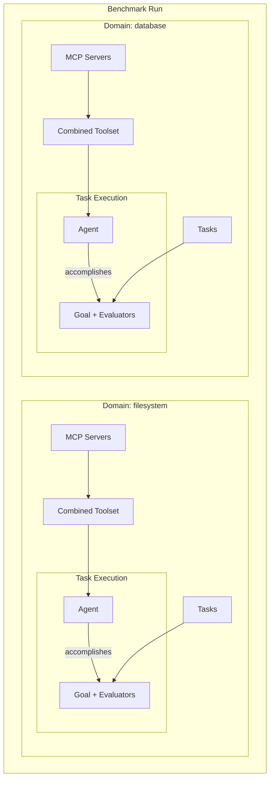
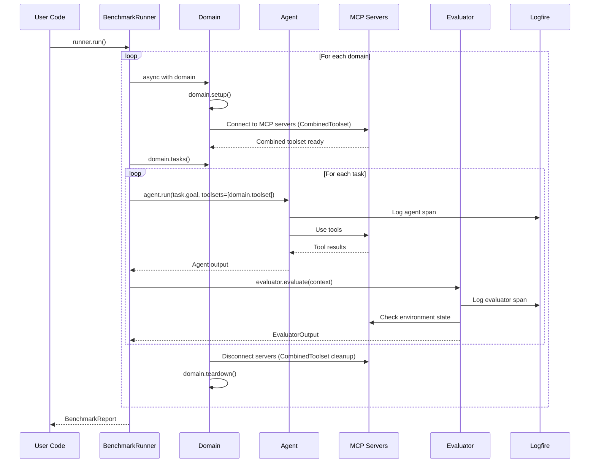
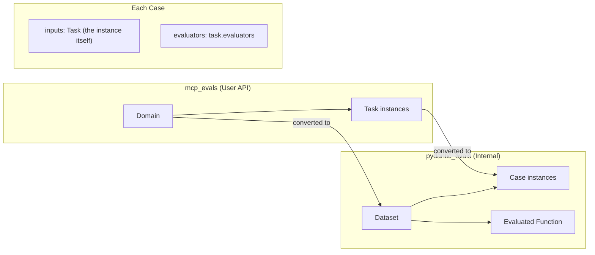

# MCP Evals

A code-first evaluation framework for testing LLM agents' ability to use MCP (Model Context Protocol) tools and accomplish tasks.

## Overview

This library provides infrastructure for running structured evaluations of LLM agents against MCP-enabled environments. Each task is defined by:

- **Domain**: A collection of MCP servers providing tools
- **Goal**: A text-described objective for the agent
- **Evaluators**: Functions that verify task completion and compute metrics

## Key Principles

| Principle | Implementation |
|-----------|----------------|
| **Code-first** | All tasks defined in Python, no YAML/JSON configs |
| **Simple user API** | Users define domains and tasks; library handles orchestration |
| **No wheel reinvention** | pydantic-ai for LLM + MCP, pydantic_evals for evaluation, logfire for observability |
| **Resource lifecycle** | Async context managers with safe cleanup |
| **Maintainability** | pytest, mypy, ruff |

## Prerequisites

### uv (for running MCP servers)

Many MCP servers are distributed as Python packages and run via `uvx` (part of [uv](https://github.com/astral-sh/uv)). `uvx` runs CLI tools in isolated environments without global installation — similar to `npx` for Node.js.

```bash
# Install uv
curl -LsSf https://astral.sh/uv/install.sh | sh

# Now you can run MCP servers like:
uvx mcp-server-filesystem /workspace
uvx mcp-server-sqlite test.db
```

MCP servers are available from:
- [Official MCP servers](https://github.com/modelcontextprotocol/servers)
- PyPI (search for `mcp-server-*`)

## Quick Start

```python
from mcp_evals import BenchmarkRunner, Domain, Task
from mcp_evals.evaluators import FileExists
from pydantic_ai import Agent
from pydantic_ai.mcp import MCPServerStdio

# Simple task as class with attributes
class CreateConfigTask(Task):
    name = "create_config"
    goal = "Create a config.json file with default settings"
    
    def __init__(self):
        # mutable attributes should be attached to instance, not class
        self.evaluators = [FileExists("config.json")]

class CreateReadmeTask(Task):
    name = "create_readme"
    goal = "Create a README.md with project description"
    
    def __init__(self):
        # mutable attributes should be attached to instance, not class
        self.evaluators = [FileExists("README.md")]

class FilesystemDomain(Domain):
    name = "filesystem"
    
    def mcp_servers(self):
        return [MCPServerStdio("uvx", "mcp-server-filesystem", "/workspace")]
    
    def tasks(self):
        return [CreateConfigTask(), CreateReadmeTask()]

async def main():
    agent = Agent("openai:gpt-4o")
    runner = BenchmarkRunner(agent=agent, domains=[FilesystemDomain()])
    report = await runner.run()
    report.print()
```

## Basic Usage

### 1. Define Tasks

Tasks are abstract async context managers that define what the agent should accomplish and how to verify it:

```python
from mcp_evals import Task
from mcp_evals.evaluators import SQLQueryReturns

class CreateUsersTableTask(Task):
    name = "create_users_table"
    goal = "Create a users table with id, name, and email columns"
    evaluators = [
        SQLQueryReturns(
            query="SELECT name FROM sqlite_master WHERE type='table'",
            expected=["users"],
        ),
    ]

class InsertUserTask(Task):
    name = "insert_user"
    goal = "Insert a user named 'Alice' with email 'alice@example.com'"
    evaluators = [
        SQLQueryReturns(
            query="SELECT name, email FROM users",
            expected=[("Alice", "alice@example.com")],
        ),
    ]
```

### 2. Define a Domain

A domain encapsulates an environment (MCP servers) and groups related tasks:

```python
from mcp_evals import Domain
from pydantic_ai.mcp import MCPServerStdio

class DatabaseDomain(Domain):
    name = "database"
    
    def mcp_servers(self):
        return [MCPServerStdio("uvx", "mcp-server-sqlite", "test.db")]
    
    def tasks(self):
        return [CreateUsersTableTask(), InsertUserTask()]
```

### 3. Run the Benchmark

```python
from mcp_evals import BenchmarkRunner
from pydantic_ai import Agent
import logfire

logfire.configure()

async def main():
    agent = Agent(
        "openai:gpt-4o",
        system_prompt="You are a helpful assistant.",
    )
    
    runner = BenchmarkRunner(
        agent=agent,
        domains=[FilesystemDomain(), DatabaseDomain()],
    )
    
    report = await runner.run()
    report.print()
    
    # Access detailed results
    for result in report.results:
        print(f"{result.task_name}: {'✓' if result.passed else '✗'}")
        for metric in result.metrics:
            print(f"  {metric.name}: {metric.value}")
```

## Advanced Usage

### 1. Custom Evaluators

Create domain-specific evaluators using `pydantic_evals` base classes:

```python
from pydantic_evals.evaluators import Evaluator, EvaluatorContext
from pydantic_evals import EvaluatorOutput, EvaluationReason

class APIResponseContains(Evaluator[TaskInput, TaskOutput]):
    endpoint: str
    expected_field: str
    
    async def evaluate(
        self, ctx: EvaluatorContext[TaskInput, TaskOutput]
    ) -> EvaluatorOutput:
        # Access the task output
        response = ctx.output
        
        if self.expected_field in response:
            return 1.0
        else:
            return EvaluationReason(
                value=0.0,
                reason=f"Field '{self.expected_field}' not found in response",
            )
```

See [pydantic_evals documentation](https://ai.pydantic.dev/evals/) for more details on evaluator types and context.

### 2. Tasks with Lifecycle (Setup/Teardown)

Tasks can implement `setup()` for initialization and use `AsyncExitStack` for clean resource management:

```python
from contextlib import AsyncExitStack
from pathlib import Path
import aiofiles.tempfile
import os

from mcp_evals import Task
from mcp_evals.evaluators import FileExists, ContentMatches

class MusicReportTask(Task):
    name = "music_report"
    goal = "Analyze the music files and create music_analysis_report.txt"
    evaluators = [
        FileExists("music/music_analysis_report.txt"),
        ContentMatches("music/music_analysis_report.txt", pattern=r"晴天.*2\.576"),
    ]
    
    _stack: AsyncExitStack | None = None  # Track context state
    
    async def setup(self) -> None:
        # Prevent re-entry
        if self._stack is not None:
            raise RuntimeError(f"Task {self.name} context already entered")
        
        self._stack = AsyncExitStack()
        await self._stack.__aenter__()
        
        # Create temp directory using async context manager
        temp_dir_ctx = aiofiles.tempfile.TemporaryDirectory()
        self.test_dir = Path(await self._stack.enter_async_context(temp_dir_ctx))
        
        # Download and extract test fixtures
        archive_path = await download_fixtures("music_collection.tar.gz")
        self._stack.callback(lambda: archive_path.unlink(missing_ok=True))
        
        await extract_archive(archive_path, self.test_dir)
        
        # Set environment variable for MCP server (will be cleared on teardown)
        old_value = os.environ.get("FILESYSTEM_ROOT")
        os.environ["FILESYSTEM_ROOT"] = str(self.test_dir)
        self._stack.callback(lambda: self._restore_env("FILESYSTEM_ROOT", old_value))
    
    async def teardown(self) -> None:
        if self._stack is not None:
            await self._stack.aclose()
            self._stack = None
    
    @staticmethod
    def _restore_env(key: str, old_value: str | None) -> None:
        if old_value is None:
            os.environ.pop(key, None)
        else:
            os.environ[key] = old_value
```

### 3. Tasks with Secrets

Use pydantic-settings for type-safe secret management:

```python
from pydantic_settings import BaseSettings
from mcp_evals import Task, TaskSecrets

class GitHubSecrets(TaskSecrets):
    github_token: str
    github_username: str

class CreateRepoTask(Task):
    name = "create_repo"
    goal = "Create a GitHub repository named 'test-repo' with a README"
    evaluators = [RepoExists("test-repo"), FileInRepoExists("test-repo", "README.md")]
    secrets_type = GitHubSecrets  # Declares which secrets this task needs
    
    async def setup(self) -> None:
        # Secrets are loaded automatically from environment
        print(f"Will create repo under: {self.secrets.github_username}")
    
    async def teardown(self) -> None:
        # Clean up: delete the repo created during the task
        await delete_github_repo(
            repo="test-repo",
            token=self.secrets.github_token,
        )
```

### 4. Domains with Secrets

Use pydantic-settings for type-safe secret management at the domain level — useful when MCP servers require authentication:

```python
from mcp_evals import Domain, DomainSecrets
from pydantic_ai.mcp import MCPServerStdio

class SlackSecrets(DomainSecrets):
    slack_bot_token: str
    slack_team_id: str

class SlackDomain(Domain):
    name = "slack"
    secrets_type = SlackSecrets  # Declares which secrets this domain needs
    
    def mcp_servers(self):
        # Secrets are loaded automatically from environment
        return [
            MCPServerStdio(
                "uvx", "mcp-server-slack",
                env={
                    "SLACK_BOT_TOKEN": self.secrets.slack_bot_token,
                    "SLACK_TEAM_ID": self.secrets.slack_team_id,
                },
            )
        ]
    
    def tasks(self):
        return [SendMessageTask(), ListChannelsTask()]
```

### 5. Domains with Lifecycle (Setup/Teardown)

Domains can implement `setup()` and `teardown()` for custom initialization and cleanup logic:

```python
from mcp_evals import Domain
from pydantic_ai.mcp import MCPServerStdio
import tempfile
import shutil

class DatabaseDomain(Domain):
    name = "database"
    
    async def setup(self) -> None:
        """Called before MCP servers are started."""
        # Create a fresh temp directory for this domain's database
        self._temp_dir = tempfile.mkdtemp(prefix="mcp_evals_")
        self._db_path = f"{self._temp_dir}/test.db"
        
        # Optionally seed the database with initial data
        await self._seed_database()
    
    async def teardown(self) -> None:
        """Called after MCP servers are stopped."""
        # Clean up temp directory
        shutil.rmtree(self._temp_dir, ignore_errors=True)
    
    def mcp_servers(self):
        return [MCPServerStdio("uvx", "mcp-server-sqlite", self._db_path)]
    
    def tasks(self):
        return [CreateUsersTableTask(), InsertUserTask()]
    
    async def _seed_database(self) -> None:
        # Custom initialization logic
        ...
```

### 6. Tasks with Dynamic Goals (Templating)

Use `@property` for dynamic goal generation:

```python
class ParameterizedTask(Task):
    name = "create_config"
    evaluators = [FileExists("config.json"), JsonFieldEquals("config.json", "port", 8080)]
    
    def __init__(self, app_name: str, port: int = 8080):
        self.app_name = app_name
        self.port = port
    
    @property
    def goal(self) -> str:
        return f"Create config.json with app_name='{self.app_name}' and port={self.port}"

# Usage in domain:
class MyDomain(Domain):
    def tasks(self):
        return [
            ParameterizedTask("web-server", port=3000),
            ParameterizedTask("api-gateway", port=8080),
        ]
```

## Architecture

### High-Level Flow



### Evaluation Pipeline



### Integration with pydantic_evals

Internally, each domain is converted to a `pydantic_evals.Dataset`. Here's how the mapping works:



#### Conversion: Domain → Dataset, Task → Case

The key insight: `Case.inputs` accepts any type, so we pass the `Task` instance directly. Evaluators receive this in their context, giving them full access to task attributes.

```python
# mcp_evals/_internal/conversion.py

from pydantic_evals import Dataset, Case
from pydantic_ai.result import RunResult

from mcp_evals import Task, Domain

def domain_to_dataset(domain: Domain) -> Dataset[Task, RunResult]:
    """Convert mcp_evals Domain to pydantic_evals Dataset."""
    cases = [
        Case(
            name=task.name,
            inputs=task,  # Task instance is the input — evaluators access it via ctx.inputs
            evaluators=task.evaluators,
        )
        for task in domain.tasks()
    ]
    return Dataset(cases=cases)
```

#### The Evaluated Function

The library defines an internal "evaluated function" that `pydantic_evals` calls for each case. This function:

1. Enters the **Task context** (`__aenter__`) for setup
2. Uses the **Agent** and **CombinedToolset** bound via `functools.partial`
3. Runs the agent with the goal and toolset
4. Exits the task context (`__aexit__`) for teardown
5. Returns `RunResult` directly for evaluation

```python
# mcp_evals/_internal/evaluated_fn.py

from typing import TypeVar
from pydantic_ai import Agent
from pydantic_ai.toolsets import CombinedToolset
from pydantic_ai.result import RunResult

from mcp_evals import Task

OutputT = TypeVar("OutputT")

async def run_agent_on_task(
    task: Task,
    *,
    agent: Agent,
    toolset: CombinedToolset,
) -> RunResult[OutputT]:
    """
    The function evaluated by pydantic_evals for each Case.
    
    Agent and toolset are bound via functools.partial before passing
    to dataset.evaluate().
    
    Evaluators receive:
    - ctx.inputs: the Task instance (access task.goal, task.secrets, etc.)
    - ctx.output: the RunResult from agent.run()
    """
    # Enter task context (calls task.setup())
    async with task:
        # Run the agent with domain's combined toolset
        result: RunResult[OutputT] = await agent.run(
            task.goal,
            output_type=task.output_type,
            toolsets=[toolset],
        )
        return result
    # Task context exits here (calls task.teardown())
```

#### Dataset Evaluation in BenchmarkRunner

```python
# mcp_evals/_internal/runner.py (simplified)

from functools import partial
from pydantic_ai import Agent
from pydantic_evals import EvalReport

from mcp_evals import Domain
from mcp_evals._internal.conversion import domain_to_dataset
from mcp_evals._internal.evaluated_fn import run_agent_on_task

async def run_domain(domain: Domain, agent: Agent) -> EvalReport:
    """Run all tasks in a domain."""
    
    # Domain is an async context manager that manages CombinedToolset lifecycle and custom user's setup/teardown logic
    async with domain:
        # Convert domain to pydantic_evals Dataset
        dataset = domain_to_dataset(domain)
        
        # Bind agent and toolset to the evaluated function
        evaluated_fn = partial(
            run_agent_on_task,
            agent=agent,
            toolset=domain.toolset,
        )
        
        # Run evaluation — pydantic_evals handles the loop
        report = await dataset.evaluate(
            evaluated_fn,
            max_concurrency=1,  # Sequential by default for stateful tasks
        )
        
        return report
```

### Scope Lifecycle

The library manages resource lifecycle at two levels:

| Scope | Managed By | Lifecycle | Resources |
|-------|------------|-----------|-----------|
| Domain | `async with domain:` | Per domain | MCP connections, CombinedToolset, domain-level fixtures |
| Task | `async with task:` | Per task execution | Temp files, env vars, task-level fixtures |

**Domain context managers** handle MCP server connections (via `CombinedToolset`) and domain-level setup/teardown.

**Task context managers** handle task-specific setup/teardown (fixtures, environment)

Users don't need to manage these contexts directly—`BenchmarkRunner` handles everything.

### TODO

- [ ] error handling
- [ ] testing strategy
- [ ] `Domain` re-entry protection
- [ ] awkward mutable pattern in tasks examples
- [ ] check tasks names uniqueness within a single domain
- [ ] check domains names uniqueness within a single benchmark run

## Project Structure

```
mcp-evals/
├── src/mcp_evals/
│   ├── __init__.py           # Public API: Domain, Task, BenchmarkRunner, etc.
│   ├── domain.py             # Domain ABC (async context manager)
│   ├── task.py               # Task ABC (async context manager)
│   ├── secrets.py            # DomainSecrets, TaskSecrets base classes
│   ├── runner.py             # BenchmarkRunner facade
│   ├── evaluators/
│   │   ├── __init__.py       # Public evaluators
│   │   └── builtin.py        # FileExists, ContentMatches, SQLQueryReturns, etc.
│   ├── _internal/
│   │   ├── conversion.py     # Domain → Dataset, Task → Case conversion
│   │   └── evaluated_fn.py   # run_agent_on_task() for pydantic_evals
│   └── contrib/              # Pre-built domains (optional)
│       ├── filesystem.py
│       └── sqlite.py
├── examples/
│   ├── filesystem_eval/
│   └── database_eval/
└── tests/
```

## API Reference

### `Domain` (ABC + Async Context Manager)

```python
from abc import ABC, abstractmethod
from contextlib import AbstractAsyncContextManager
from functools import cached_property
from typing import ClassVar

from pydantic_settings import BaseSettings
from pydantic_ai.mcp import MCPServer
from pydantic_ai.toolsets import CombinedToolset


class DomainSecrets(BaseSettings):
    """Base for domain-specific secrets. Override in subclasses."""
    model_config = {"extra": "ignore", "env_file": ".env"}


class Domain(AbstractAsyncContextManager, ABC):
    """
    Abstract base for evaluation domains.
    
    Domain is an async context manager that:
    1. Calls setup() for user-defined initialization
    2. Enters the CombinedToolset context (connects to MCP servers)
    3. Provides toolset property for agent execution
    4. Exits the CombinedToolset context on cleanup (disconnects MCP servers)
    5. Calls teardown() for user-defined cleanup
    
    Required attributes/methods:
        name: str                    - Unique domain identifier
        mcp_servers() -> list        - Returns MCP server configurations
        tasks() -> list[Task]        - Returns Task instances to evaluate
    
    Optional attributes:
        secrets_type: ClassVar[type] - BaseSettings subclass for secrets
    
    Lifecycle methods (override as needed):
        setup()    - Called before MCP servers are started
        teardown() - Called after MCP servers are stopped
    """
    
    # === Required ===
    name: str
    
    @abstractmethod
    def mcp_servers(self) -> list[MCPServer]:
        """Return MCP server configurations."""
    
    @abstractmethod
    def tasks(self) -> list["Task"]:
        """Return Task instances to evaluate in this domain."""
    
    # === Optional with defaults ===
    secrets_type: ClassVar[type[DomainSecrets]] = DomainSecrets
    
    # === Secrets access ===
    @cached_property
    def secrets(self) -> DomainSecrets:
        """Load and cache secrets from environment."""
        return self.secrets_type()
    
    # === Toolset access (available after __aenter__) ===
    _toolset: CombinedToolset | None = None
    
    @property
    def toolset(self) -> CombinedToolset:
        """Access the CombinedToolset. Only available inside context."""
        if self._toolset is None:
            raise RuntimeError(
                f"Domain '{self.name}' toolset accessed outside context. "
                "Use 'async with domain:' first."
            )
        return self._toolset
    
    # === Lifecycle ===
    async def __aenter__(self) -> "Domain":
        # User-defined setup
        await self.setup()
        
        # Create and enter CombinedToolset context
        self._toolset = CombinedToolset(self.mcp_servers())
        await self._toolset.__aenter__()
        
        return self
    
    async def __aexit__(self, exc_type, exc_val, exc_tb) -> bool | None:
        # Exit CombinedToolset context (disconnect MCP servers)
        if self._toolset is not None:
            await self._toolset.__aexit__(exc_type, exc_val, exc_tb)
            self._toolset = None
        
        # User-defined teardown
        await self.teardown()
        
        return None
    
    async def setup(self) -> None:
        """Override to perform setup before MCP servers are started."""
        pass
    
    async def teardown(self) -> None:
        """Override to perform cleanup after MCP servers are stopped."""
        pass
```

### `Task` (ABC + Async Context Manager)

```python
from abc import ABC
from contextlib import AbstractAsyncContextManager
from functools import cached_property
from typing import ClassVar, Sequence

from pydantic_settings import BaseSettings


class TaskSecrets(BaseSettings):
    """Base for task-specific secrets. Override in subclasses."""
    model_config = {"extra": "ignore", "env_file": ".env"}


class Task(AbstractAsyncContextManager, ABC):
    """
    Abstract base for evaluation tasks.
    
    Required attributes (class attributes or @property):
        name: str                    - Unique task identifier
        goal: str                    - Prompt/instruction for the agent
        evaluators: Sequence[Evaluator] - Verification functions
    
    Optional attributes:
        output_type: type | None     - Pydantic model for structured output
        secrets_type: ClassVar[type] - BaseSettings subclass for secrets
    
    Lifecycle methods (override as needed):
        setup()    - Called on __aenter__, before agent runs
        teardown() - Called on __aexit__, after agent completes
    """
    
    # === Required (implement as class attr or @property) ===
    name: str
    goal: str
    evaluators: Sequence["Evaluator"]
    
    # === Optional with defaults ===
    output_type: type | None = None
    secrets_type: ClassVar[type[TaskSecrets]] = TaskSecrets
    
    # === Secrets access ===
    @cached_property
    def secrets(self) -> TaskSecrets:
        """Load and cache secrets from environment."""
        return self.secrets_type()
    
    # === Lifecycle (default implementations) ===
    async def __aenter__(self) -> "Task":
        await self.setup()
        return self
    
    async def __aexit__(self, exc_type, exc_val, exc_tb) -> bool | None:
        await self.teardown()
        return None
    
    async def setup(self) -> None:
        """Override to perform setup before agent execution."""
        pass
    
    async def teardown(self) -> None:
        """Override to perform cleanup after agent execution."""
        pass
```

### `DomainSecrets` / `TaskSecrets` (BaseSettings)

```python
from pydantic_settings import BaseSettings

class DomainSecrets(BaseSettings):
    """
    Base class for domain-specific secrets.
    
    Subclass to declare required environment variables:
    
        class SlackSecrets(DomainSecrets):
            slack_bot_token: str   # Required: SLACK_BOT_TOKEN env var
            slack_team_id: str     # Required: SLACK_TEAM_ID env var
    
    Then reference in Domain:
    
        class SlackDomain(Domain):
            secrets_type = SlackSecrets
            
            def mcp_servers(self):
                return [MCPServerStdio(
                    "uvx", "mcp-server-slack",
                    env={"SLACK_BOT_TOKEN": self.secrets.slack_bot_token},
                )]
    """
    model_config = {"extra": "ignore", "env_file": ".env"}


class TaskSecrets(BaseSettings):
    """
    Base class for task-specific secrets.
    
    Subclass to declare required environment variables:
    
        class MySecrets(TaskSecrets):
            api_key: str           # Required: API_KEY env var
            timeout: int = 30      # Optional with default
    
    Then reference in Task:
    
        class MyTask(Task):
            secrets_type = MySecrets
            
            async def setup(self):
                print(self.secrets.api_key)  # Type-safe access
    """
    model_config = {"extra": "ignore", "env_file": ".env"}
```

### `BenchmarkRunner`

```python
class BenchmarkRunner:
    def __init__(
        self,
        agent: Agent,
        domains: list[Domain],
    ) -> None: ...

    async def run(self) -> BenchmarkReport:
        """Run all tasks from all domains."""
        ...
```

### Evaluators

This library uses [pydantic_evals](https://ai.pydantic.dev/evals/) for evaluation infrastructure. Key types:

- `Evaluator[InputT, OutputT]` — Base class for custom evaluators
- `EvaluatorContext[InputT, OutputT]` — Context passed to evaluators with input/output data
- `EvaluatorOutput` — Result containing score, reason, and optional labels

See `mcp_evals.evaluators` for built-in evaluators.

## Built-in Evaluators

TODO

## Pre-built Domains

TODO

## Dependencies

- **[pydantic-ai](https://ai.pydantic.dev/)** — LLM provider abstraction + MCP client
- **[pydantic-evals](https://ai.pydantic.dev/evals/)** — Evaluation infrastructure (Dataset, Case, Evaluator)
- **[pydantic-settings](https://docs.pydantic.dev/latest/concepts/pydantic_settings/)** — Environment-based secrets management
- **[logfire](https://pydantic.dev/logfire)** — Observability and tracing

## Development

```bash
# Install dependencies
uv sync

# Run tests
uv run pytest

# Type checking
uv run mypy src/

# Linting
ruff check --fix
ruff format
```
