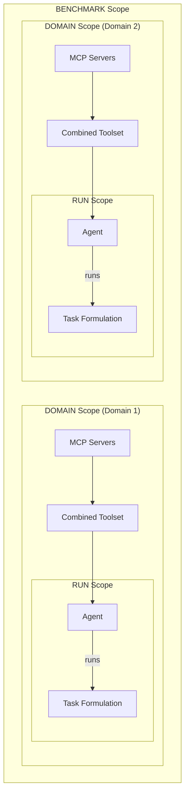
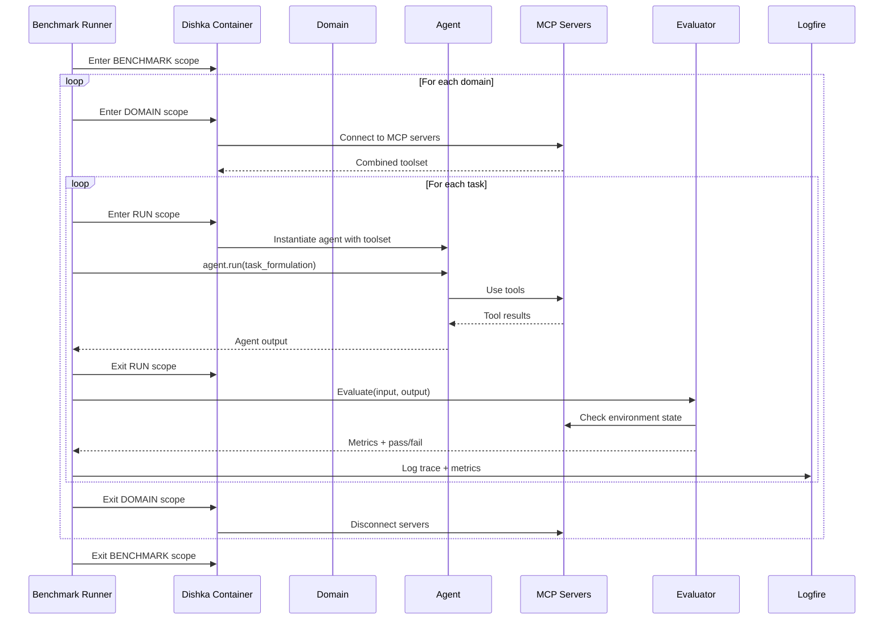
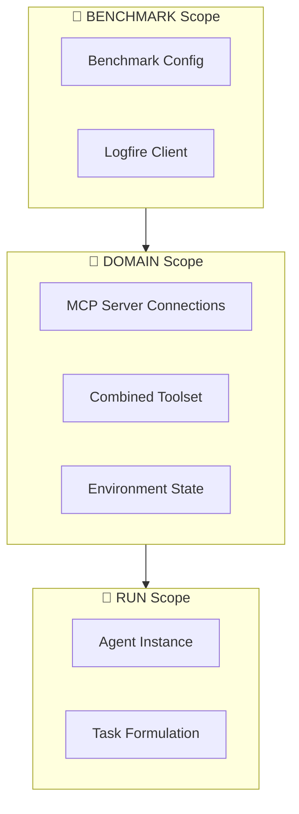

# MCP Evals

A code-first evaluation framework for testing LLM agents' ability to use MCP (Model Context Protocol) tools and accomplish tasks.

## Overview

This library provides infrastructure for running structured evaluations of LLM agents against MCP-enabled environments. Each task is defined by:

- **MCP Servers**: A collection of stdio/HTTP MCP servers providing tools
- **Goal**: A text-described objective for the agent
- **Evaluators**: Functions that verify task completion and compute metrics

## Key Principles

| Principle | Implementation |
|-----------|----------------|
| **Code-first** | All tasks defined in Python, no YAML/JSON configs |
| **No wheel reinvention** | pydantic-ai for LLM + MCP, pydantic_evals for evaluation, logfire for observability |
| **Resource lifecycle** | Async context managers, exit stacks, async generators |
| **Dependency injection** | Dishka for resource acquisition and cleanup |
| **Maintainability** | pytest, mypy, ruff |

## Architecture

### High-Level Flow



### Evaluation Pipeline



### DI Scopes & Lifecycles



| Scope | Lifecycle | Provides |
|-------|-----------|----------|
| `BENCHMARK` | Entire evaluation run | Global config, logfire client |
| `DOMAIN` | Per task domain | MCP connections, combined toolset, shared environment |
| `RUN` | Per task execution | Agent instance, task formulation |

## Usage

### 1. Define a Domain with MCP Servers

```python
from dataclasses import dataclass
from dishka import Provider, Scope, provide
from pydantic_ai import Agent
from pydantic_ai.mcp import MCPServerStdio, MCPServerHTTP

class FilesystemDomainProvider(Provider):
    scope = Scope.DOMAIN
    
    @provide
    async def mcp_servers(self) -> list[MCPServerStdio | MCPServerHTTP]:
        return [
            MCPServerStdio("uvx", "mcp-server-filesystem", "/workspace"),
            MCPServerHTTP("http://localhost:8080/mcp"),
        ]
```

### 2. Define a Task Case

```python
from dataclasses import dataclass
from pydantic_evals import Case
from dishka import AsyncContainer

@dataclass
class TaskInput:
    task_formulation: str
    container: AsyncContainer
    output_type: type | None = None

# Create evaluation case
case = Case(
    name="create_config_file",
    inputs=TaskInput(
        task_formulation="Create a config.json file with default settings",
        container=container,
    ),
    evaluators=[FileExistsEvaluator("config.json"), ContentEvaluator(...)],
)
```

### 3. Define the Evaluated Function

```python
from dishka import FromDishka
from pydantic_ai import Agent

async def run_agent_task(input: TaskInput) -> str:
    async with input.container.scope(Scope.RUN) as run_container:
        agent = await run_container.get(Agent)
        result = await agent.run(input.task_formulation)
        return result.data
```

### 4. Run the Evaluation

```python
from pydantic_evals import Dataset
import logfire

logfire.configure()

dataset = Dataset(cases=[case1, case2, case3])

async with container.scope(Scope.BENCHMARK):
    for domain in domains:
        async with container.scope(Scope.DOMAIN):
            report = await dataset.evaluate(run_agent_task)
            report.print()
```

## Project Structure

```
mcp-universe-adapted/
├── src/
│   └── mcp_eval/
│       ├── __init__.py
│       ├── scopes.py          # Custom Dishka scopes
│       ├── providers.py       # DI providers
│       ├── evaluators.py      # Custom pydantic_evals evaluators
│       └── domains/           # Domain definitions
│           ├── filesystem/
│           ├── database/
│           └── ...
├── tests/
├── pyproject.toml
└── README.md
```

## Dependencies

- **[pydantic-ai](https://ai.pydantic.dev/)** — LLM provider abstraction + MCP client
- **[pydantic-evals](https://ai.pydantic.dev/evals/)** — Experimentation framework
- **[logfire](https://pydantic.dev/logfire)** — Observability and tracing
- **[dishka](https://github.com/reagento/dishka)** — Dependency injection

## Development

```bash
# Install dependencies
uv sync

# Run tests
pytest

# Type checking
mypy src/

# Linting
ruff check src/
ruff format src/
```

## License

MIT

